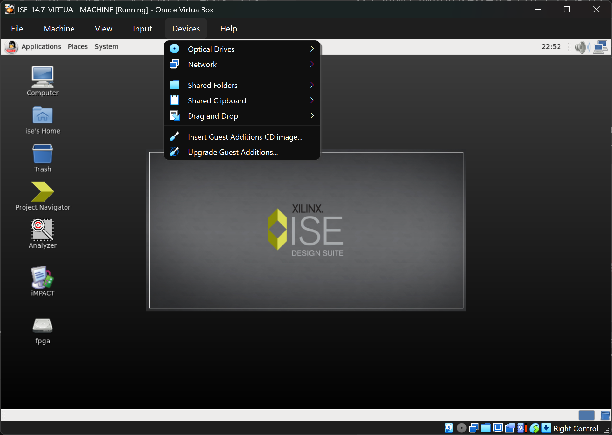

# Papilio Pro 開発環境構築 for Windows

Windows 11 環境で Papilio Pro FPGA モジュールの開発環境を構築するための手順とカスタマイズ方法をまとめたリポジトリです。

## 概要

このリポジトリは、Xilinxの公式ドキュメント [UG1227 "ISE 14.7 VM for Windows 10 & 11 User Guide"](https://docs.xilinx.com/v/u/en-US/ug1227-ise-vm-windows10) をベースにしています。公式ドキュメントだけでは分かりにくい点や、追加で必要となる設定について補足説明を提供し、Papilio Proを使った開発をよりスムーズに始められるようにすることを目的としています。

## このリポジトリが解決すること

Papilio Proは古のFPGAボードであるため、最新のWindows環境で開発環境を整えるには少し工夫が必要です。XilinxはISE Design Suite 14.7を仮想マシン(VM)で動作させる方法を公式に提供していますが、それに加えて少しの作業をすることで快適になります。

-   日本語キーボードに対応
-   Host OS (Windows 11) とのcopy & pasteが正しくできるようupdate

このリポジトリでは、これらのための具体的な手順やTipsを提供します。

## 前提条件

-    Windows 11 がインストールされたPC
-   Papilio Pro FPGA モジュール
-   [Oracle VM VirtualBox](https://www.virtualbox.org/) がインストール済みであること

## 環境構築手順

### Step 1: ISE 14.7 VMのセットアップ

はじめに、Xilinxの公式ドキュメント [UG1227](https://docs.xilinx.com/v/u/en-US/ug1227-ise-vm-windows10) に従って、ISE 14.7 VMのダウンロードと基本的なセットアップを完了させてください。大まかな流れは下記です。

- Oracle VirtualBox を install
- ISE 14.7 VM のzipファイルを download (AMD account登録が必要) して展開
- xsetup.exe を実行
    - このinstallの過程でhost OSであるWindowsとVirtual Box内Virtual Machineの共有フォルダを作成できる。やっておくのがおすすめ。

これでとりあえずinstall完了。
downloadしたzipファイルと、それを展開したものはもう不要なので削除してOK。
windowsのstart menuのXilinxグループにある Project Navigator をクリックすると Virtual Machine が起動する。

- time zoneを設定
    - 設定変更した瞬間に反映されるわけではなさそう。再起動したら反映された。

### Step 2: カスタマイズ

快適にするための工夫

- 日本語keyboard対応
  
  > [!NOTE]
  > ここで言う「日本語keyboard対応」とは、日本語入力(IME)のことではなく、記号などのキー配列を日本語キーボードに合わせるための設定を指します。例えば、`Shift` + `9` を押したときに `(` ではなく `)` が入力されてしまう、といった問題を解消します。
    - Guest OSのtask barの System - Preferences - Keyboard
    - タブ Layouts
    - Check box "Separate layout for each window" のチェックを外す
    - Seleted layouts の下にあるボタン "Add"
    - CountryでJapanを選択 - ボタン "Add"
    - Seleted layouts にある選択肢にJapaneseが加わったことを確認してEnglish (US) をRemove
- copy & paste修正
  > [!NOTE]
  > コピペが途中で切れてしまったりする問題を解決
    - Virtual Box の menu "Devices" から Insert Guest Additions CD image... を選択
    
    - mountされたら自動実行するかと聞かれるので同意する
    - passwordを聞かれるので [UG1227](https://docs.xilinx.com/v/u/en-US/ug1227-ise-vm-windows10) で示されているxilinxと入力
    - これでinstallが進み、終わって何かkeyを押すとwindowが閉じる
    - CD image を右クリックして Eject を選択
    - 再起動する

### Step 3: 他

- constraint
- papilio loader
